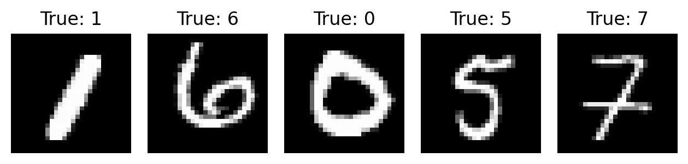
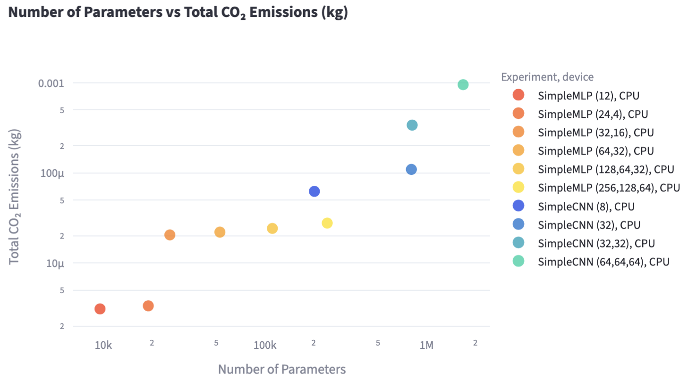
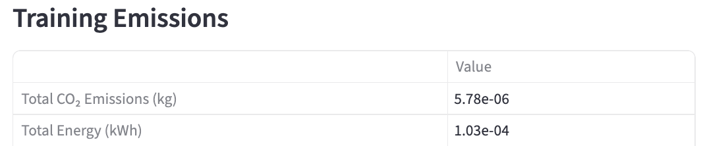
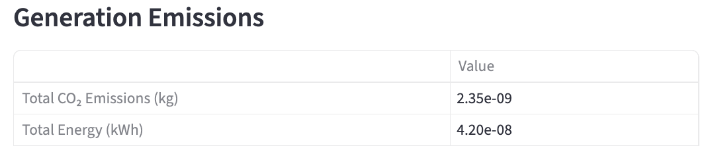
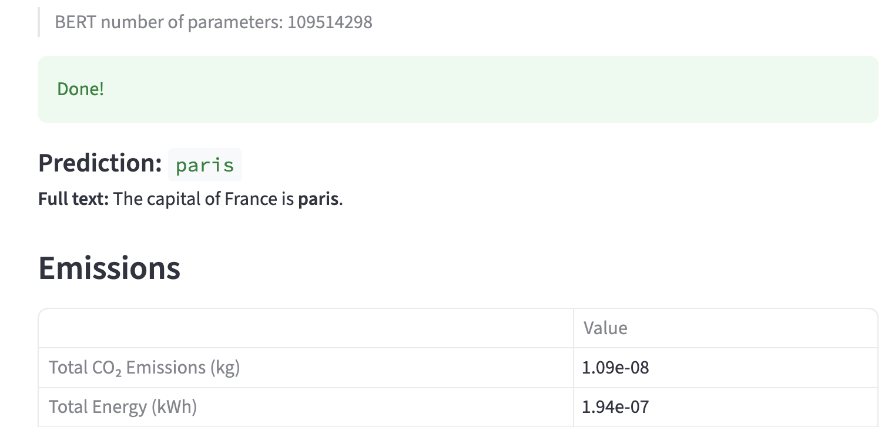
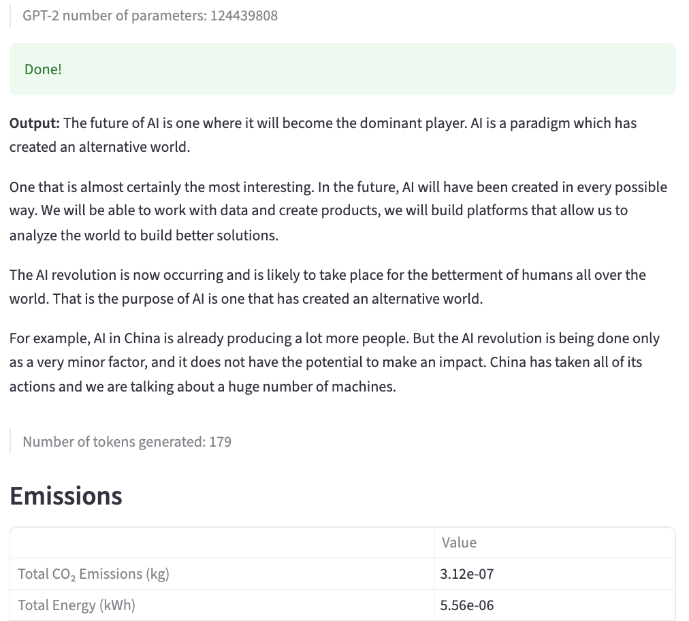

# Description

This project provides a hands-on environment to explore the behavior and environmental impact of various "AI" models. Using the [CodeCarbon library](https://codecarbon.io/), it automatically tracks energy consumption and CO₂ emissions during model execution.

**Key Features:**
- Image Classification: Compare simple MLPs and CNNs on the MNIST dataset.
- Image Generation: Experiment with CVAEs, PCA-based models, and probabilistic pixel approaches.
- Text Generation: Test BERT (fill-in-the-blank) and GPT-2 (free text) models.

**How It’s Structured:**
- A Streamlit app for interactive exploration.
- Two Jupyter notebooks—one introductory, one in-depth—for deeper analysis.

**Why It Matters:**
- Understand how different machine learning models perform in practice.
- Assess the environmental impact of model choices.
- Explore ways to mitigate environmental impact of machine learning depending on the task.

# Overview of the content

This project includes a variety of visual outputs to help you explore how different models behave — and how much CO₂ they emit.

For the image-related tasks, we use the classic MNIST dataset of handwritten digits:



## 🏷️ Image Classification

For classification, you can compare MLP and CNN models and track useful metrics during training — including how CO₂ emissions scale with the number of model parameters:


## 🎨 Image Generation

The image generation section explores several approaches such as CVAEs, PCA-based models, and probabilistic pixel models.
Each experiment includes the CO₂ emissions for both training and inference.

Below is an example using a CVAE:

<div style="display: flex; gap: 20px; align-items: flex-start;"> 
    <div style="flex: 1;"> 
        <strong>C-VAE Generated Images</strong>
        <br> 
         
    </div> 
    <div style="flex: 8; display: flex; flex-direction: column; gap: 10px;"> 
        <div> 
            <strong>C-VAE CO₂ Emissions (Training)</strong>
            <br>
            
        </div>
        <div>
            <strong>C-VAE CO₂ Emissions (Generation)</strong>
            <br>
            
        </div>
    </div>
</div>

## 💬 Text Generation

Finally, the text generation examples showcase emissions from inference using models like BERT (masked prediction) and GPT-2 (autoregressive generation):




# Setup

If you don't have `uv` installed (recommended for faster virtual environment creation and management), you can do so via pip:

```bash
pip3 install uv
```

To get started, create and activate a virtual environment, then install the required dependencies:

```bash
uv venv .venv
source .venv/bin/activate
uv pip install -r requirements.txt
```

*NB: To exit the virtual environment later, simply run: `deactivate`*

# Usage

You can explore the project using one of the following three options.

Each option provides access to similar content but with different levels of interactivity and detail:

1. **Streamlit App** (Interactive Interface): 
Launch the interactive dashboard with `streamlit run streamlit_app/Home.py`. 
This is the most user-friendly way to navigate the experiments and visualize results.
2. **Jupyter Notebook — Simplified Version** (`main_simpler.ipynb`): 
This notebook highlights the results with minimal code, ideal for quick exploration.
3. **Jupyter Notebook — Full Version** (`main.ipynb`): 
This version exposes more of the underlying implementations and is suitable for studying or modifying the code.

# Environmental Impact Tracking

The environmental impact tracking is done using the `codecarbon` library. You can find more information about it on the [website](https://codecarbon.io/) or in the [documentation](https://mlco2.github.io/codecarbon/index.html).
